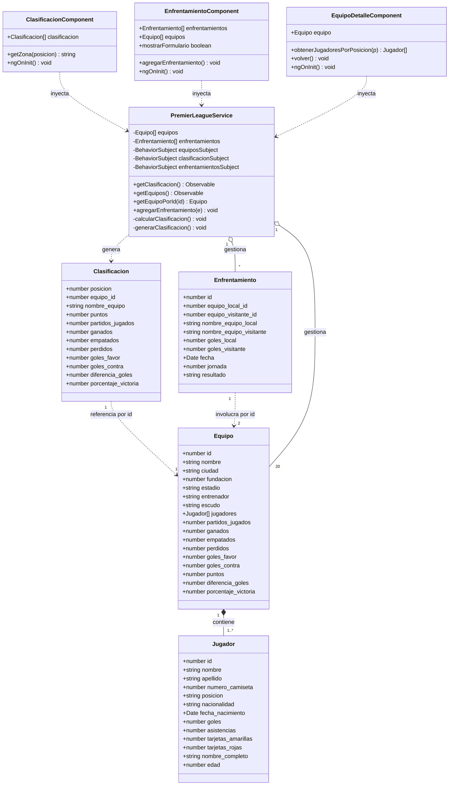

# Clasificación Premier League - Angular

## Descripción del Proyecto

Aplicación Angular que reproduce la práctica de Clasificación de la Premier League con modelos de datos orientados a objetos (POO) y componentes separados por funcionalidad visual.

## Requisitos de la práctica (versión depurada)

Esta práctica se desarrollará íntegramente en el tiempo de clase y persigue afianzar los conocimientos adquiridos. Requisitos esenciales:

- **Objetivo:** Reproducir la práctica "Clasificación" anterior implementándola en una aplicación Angular.
- **Modelo de datos:** La información debe almacenarse en modelos (POO), no en matrices simples.
- **Repositorio:** Proyecto Angular funcional subido al repositorio del alumno.
- **Diagrama de clases:** Incluir en la documentación (por ejemplo, en GIT) un UML del diagrama de clases.
- **Componentes:** Crear componentes separados por partes visibles y por funcionalidad (p. ej. componente para la clasificación, otro para el cuadro/enfrentamientos, etc.).
- **Detalle de equipo:** El nombre de cada equipo en la lista debe ser un enlace a una ficha de datos del equipo; la ficha puede incluir, por ejemplo, el listado de jugadores.
- **Datos:** Todos los datos deben estar cargados.
- **Extensiones valoradas:** Se valorará funcionalidad adicional aportada por el alumno.

## Requisitos Implementados

1. ✅ **Modelo de datos en POO** - Clases para Equipo, Jugador, Clasificación y Enfrentamiento
2. ✅ **Proyecto Angular funcional** - Subido a repositorio con todas las dependencias
3. ✅ **Documentación UML** - Diagrama de clases planteado (en este README)
4. ✅ **Componentes separados** - Clasificación, Equipo-Detalle, Enfrentamiento
5. ✅ **Enlaces en equipos** - Nombres de equipos son enlaces a fichas de datos
6. ✅ **Funcionalidad adicional** - Listado de jugadores por posición en ficha de equipo
7. ✅ **Datos cargados** - Todos los 20 equipos de la Premier League con jugadores

---

## Diagrama UML de Clases

> GitHub renderiza automáticamente los diagramas Mermaid.



---

## Estructura del Proyecto

```
src/
├── app/
│   ├── models/
│   │   ├── equipo.model.ts           # Modelo de Equipo
│   │   ├── jugador.model.ts          # Modelo de Jugador
│   │   ├── clasificacion.model.ts    # Modelo de Clasificación
│   │   └── enfrentamiento.model.ts   # Modelo de Enfrentamiento
│   │
│   ├── services/
│   │   └── premier-league.service.ts # Servicio con datos de Premier League
│   │
│   ├── components/
│   │   ├── clasificacion/            # Componente tabla de clasificación
│   │   │   ├── clasificacion.component.ts
│   │   │   ├── clasificacion.component.html
│   │   │   └── clasificacion.component.css
│   │   │
│   │   ├── equipo-detalle/           # Componente ficha de equipo
│   │   │   ├── equipo-detalle.component.ts
│   │   │   ├── equipo-detalle.component.html
│   │   │   └── equipo-detalle.component.css
│   │   │
│   │   └── enfrentamiento/           # Componente de enfrentamientos
│   │       ├── enfrentamiento.component.ts
│   │       ├── enfrentamiento.component.html
│   │       └── enfrentamiento.component.css
│   │
│   ├── app.component.ts              # Componente raíz
│   ├── app.component.html            # Plantilla con navegación
│   ├── app.component.css             # Estilos principales
│   ├── app.routes.ts                 # Definición de rutas
│   └── app.config.ts                 # Configuración de la aplicación
│
├── main.ts
├── styles.css
└── index.html
```

---

## Características Implementadas

### 1. **Modelos de Datos (POO)**
- `Equipo`: Información del equipo con estadísticas
- `Jugador`: Jugadores con posición, nacionalidad y estadísticas
- `Clasificación`: Tabla de clasificación ordenada
- `Enfrentamiento`: Partidos disputados

### 2. **Componentes**
- **Clasificación**: Tabla interactiva con enlaces a fichas de equipos
- **Equipo-Detalle**: Ficha completa con plantilla de jugadores organizada por posición
- **Enfrentamiento**: Formulario para agregar nuevos partidos

### 3. **Servicio**
- **PremierLeagueService**: Gestiona todos los datos y cálculos de clasificación

### 4. **Funcionalidad**
- ✅ Tabla de clasificación con 20 equipos
- ✅ Enlaces a fichas de equipo desde nombres
- ✅ Ficha de equipo con datos completos
- ✅ Plantilla de 15 jugadores por equipo organizados por posición
- ✅ Formulario para agregar enfrentamientos
- ✅ Actualización automática de clasificación

---

## 🛠️ Instalación y Uso

### Requisitos
- Node.js 18+
- Angular CLI 18+

### Instalación
```bash
# Instalar dependencias
npm install

# Ejecutar servidor de desarrollo
npm start

# La aplicación estará disponible en http://localhost:4200
```

### Compilación para producción
```bash
npm run build
```

---

## Datos Incluidos

### 20 Equipos de la Premier League:
1. Manchester City
2. Liverpool
3. Arsenal
4. Chelsea
5. Manchester United
6. Tottenham
7. Newcastle
8. Aston Villa
9. Fulham
10. Brighton
11. Brentford
12. West Ham
13. Crystal Palace
14. Everton
15. Nottingham Forest
16. Sunderland
17. AFC Bournemouth
18. Leeds United
19. Burnley
20. Wolves

### Cada equipo incluye:
- 15 jugadores (1 portero, 4 defensas, 4 centrocampistas, 2 delanteros)
- Información completa del equipo
- Estadísticas de temporada
- Datos de enfrentamientos iniciales

---

## Estilos y Diseño

- **Navbar**: Barra de navegación azul con enlaces activos
- **Tablas**: Diseño limpio con colores por categorías
  - 🔵 Azul: Champions League (posiciones 1-4)
  - 🟠 Naranja: Europa League (posiciones 5-6)
  - 🔴 Rojo: Descenso (posiciones 18-20)
- **Responsive**: Adaptable a dispositivos móviles
- **Animaciones**: Transiciones suaves en interacciones

---

## Licencia

Este proyecto es parte de una práctica educativa.

---

## Autor

Desarrollado como práctica de Angular con enfoque en POO y componentes.

---

## Rutas de la Aplicación

```
GET /                              - Clasificación principal
GET /equipo/:id                    - Ficha de equipo específico
GET /enfrentamientos               - Gestor de enfrentamientos
```

---

## Tecnologías Utilizadas

- **Angular 18** - Framework principal
- **TypeScript** - Lenguaje de programación
- **RxJS** - Manejo de observables
- **CSS3** - Estilos responsive
- **Standalone Components** - Arquitectura moderna de Angular

---
